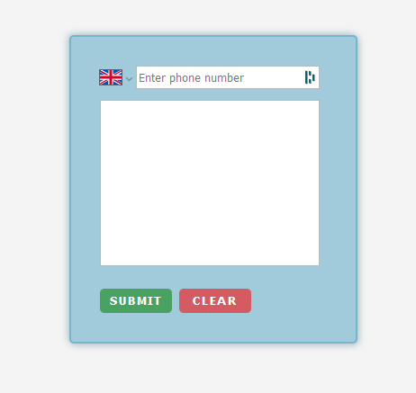

# SMS Integration

## Overview
This project aims to demonstrate the implementation of SMS integration with the MERN stack using Twilio. It showcases the integration of Twilio's API into a web application to enable sending text messages.

## Screenshot
<p style="text-align:center;">
    
</p>

## Technologies Used

- React.js, Node.js, Express.js
- Twilio API (npm twilio package, version 4.12.0)

## Features

- Dropdown Country Code (Default: GB): Provides a user-friendly dropdown menu to select the country code for the phone number, ensuring accurate and standardized input.

- Clear Button: Offers a clear button functionality to reset the input fields, allowing users to easily remove entered information and start fresh.

- Input Checker: Implements an input checker that validates whether all required fields are filled before sending an SMS. It ensures that users provide the necessary information, reducing errors and incomplete submissions.


## Installation

To get started with this project, follow these steps:

1. Clone the repository to your local machine using the following command:
```
    git clone https://github.com/martindocs/practice_sms_integration
```
2. Navigate to the project client directory:
```
    cd practice_sms_integration/client
```
3. Install the necessary dependencies:
```
    npm install
```
4. From the client folder navigate to the server folder and install necessary dependencies:
```
    cd ../server/ & npm install
```
5. Configure environment variables:
- Create a `.env` file in the root of the project.
- Add the required environment variables (e.g., Twilio credentials, API keys, etc.) to the `.env` file. You can refer to the `.env.example` file for a template.
6. Start the application:
```
    npm start
```
7. Access the application in your web browser at `http://localhost:3000`

## License

Please refer to the [LICENSE](./LICENSE.md) file in this repository for details on how this project is licensed.

## Contact

You can reach me out via twitter [@MartinTatarski](https://twitter.com/@MartinTatarski).

